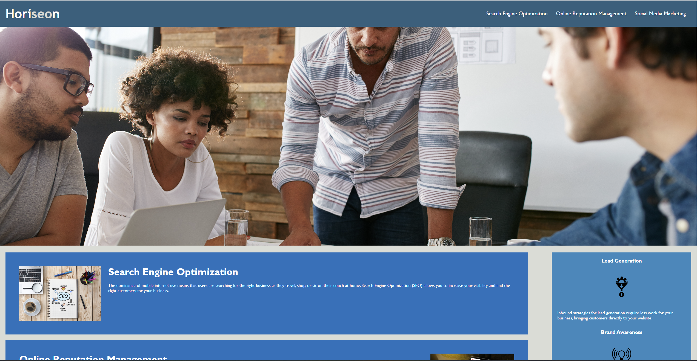

# Website Refactoring
Refactoring HTML practice

## Description
This is a refactored website to make it follow accesibility standards and is optimized for search engines. Here is what the website looks like. To see the deployed site, here is the link --> https://lunar-potato.github.io/website-refactoring/

## Installation

N/A

## Usage

This website can be used to see proper semantic HTML elements and to know more about SEO (Search Engine Optimization). This website can also be used on how to properly make a readable and semantic website with proper comments and alt texts.

## Credits

N/A

## License

License is under MIT. Please refer to the LICENSE in the repository. 

